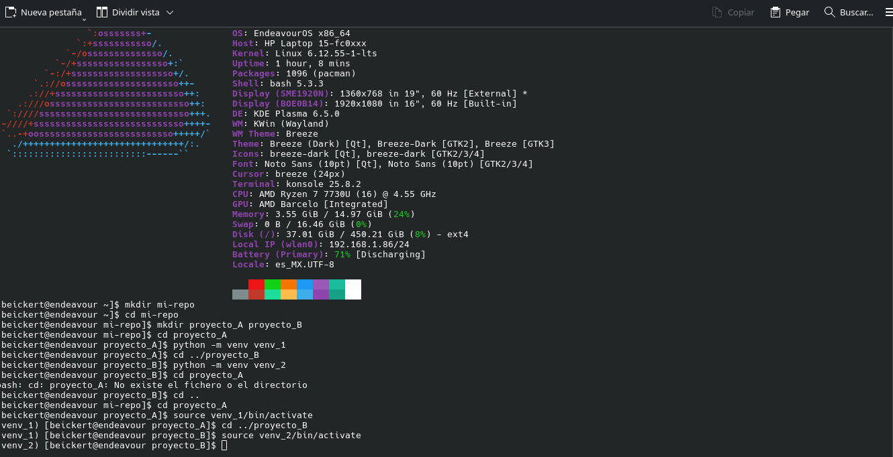
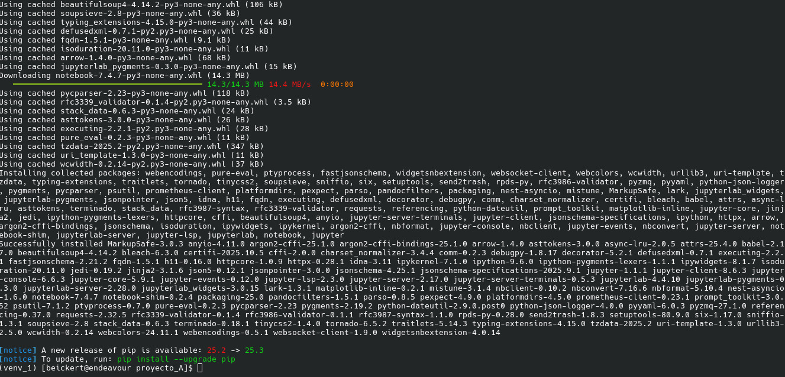
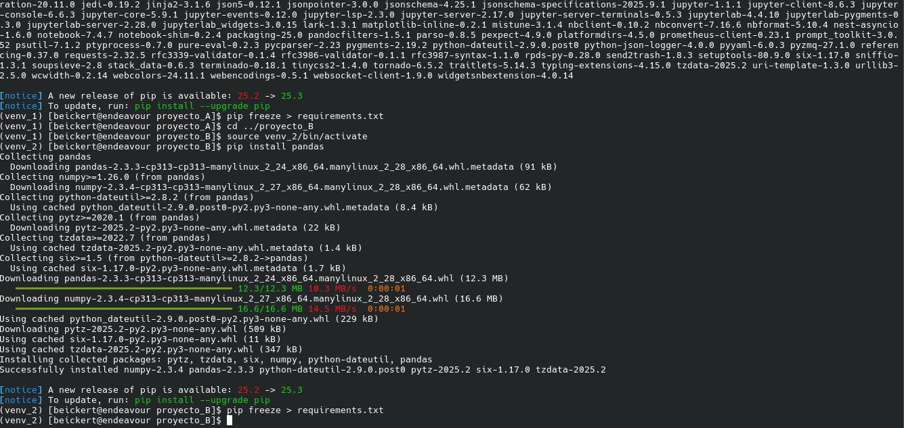
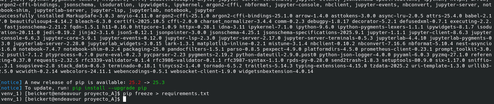

---

##  Detalles de cada proyecto

### 🔹 **Proyecto A**
- Carpeta: `proyecto_A/`
- Entorno virtual: `venv_1`
- Paquete instalado: `jupyter`
- Contiene:
  - `algoritmo_a.py`: script con un algoritmo simple.
  - `notebook_a.ipynb`: demostración o análisis en Jupyter Notebook.
- Archivo `requirements.txt` con las dependencias del entorno.

---

### 🔹 **Proyecto B**
- Carpeta: `proyecto_B/`
- Entorno virtual: `venv_2`
- Paquete instalado: `pandas`
- Contiene:
  - `algoritmo_b1.py` y `algoritmo_b2.py`: scripts que ejecutan operaciones con pandas.
- Archivo `requirements.txt` con las dependencias del entorno.

---

# dominio_entornos_virtuales

## Evidencias del proyecto

### 1. Creación del entorno virtual

### 2. Instalación de paquetes

### 3. creacion de requirements

## version python :Python 3.13.7
